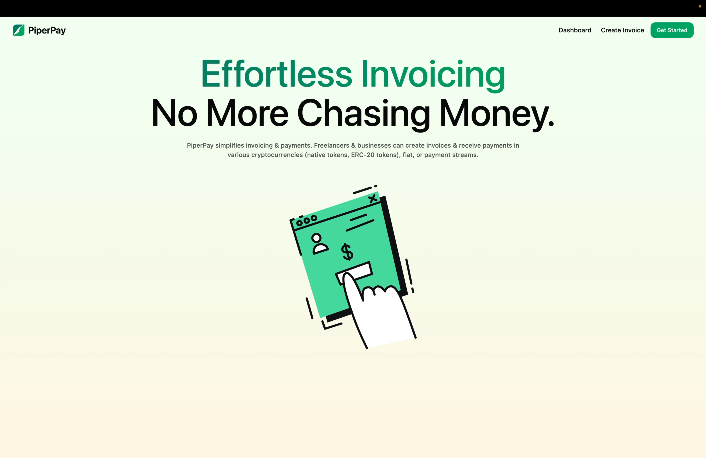
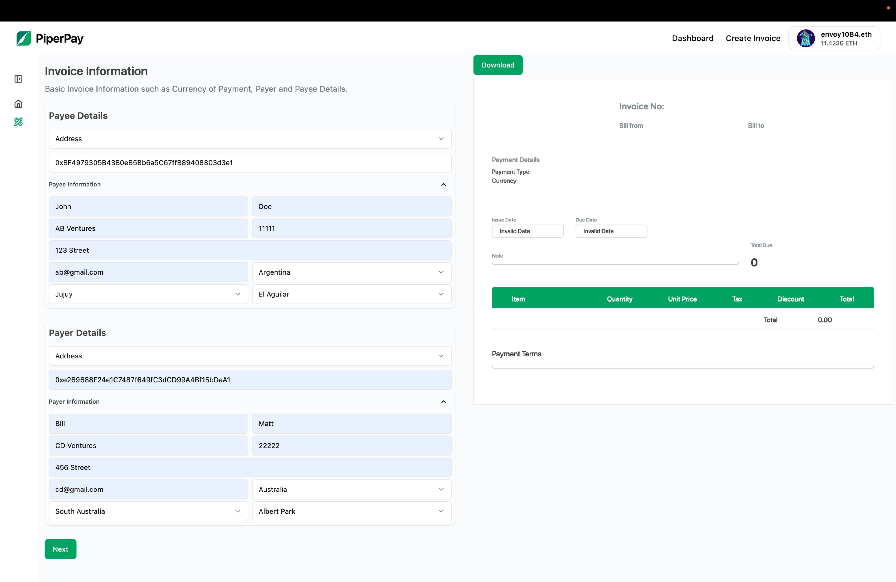
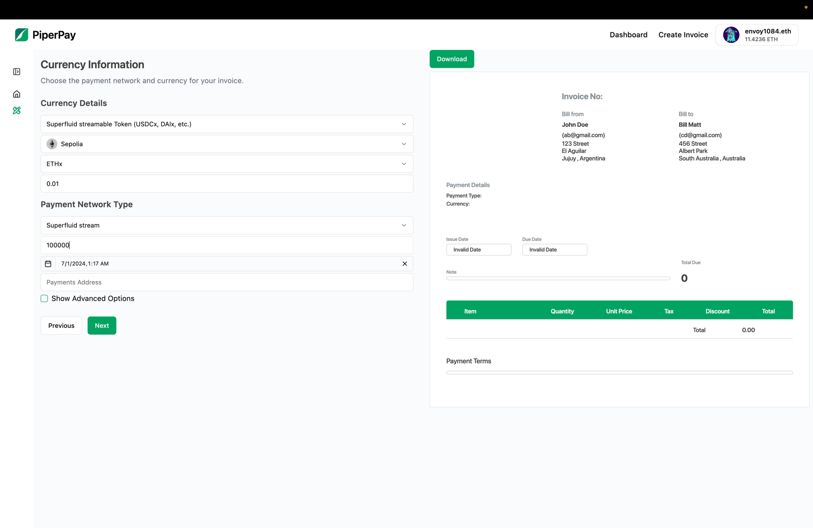
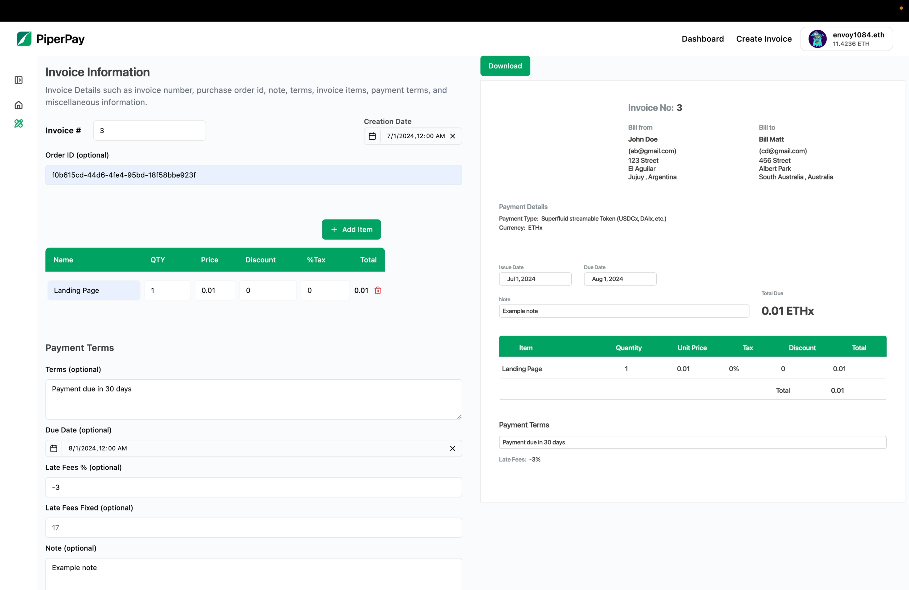
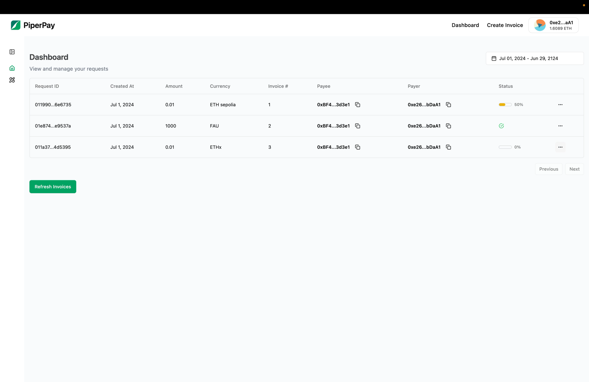
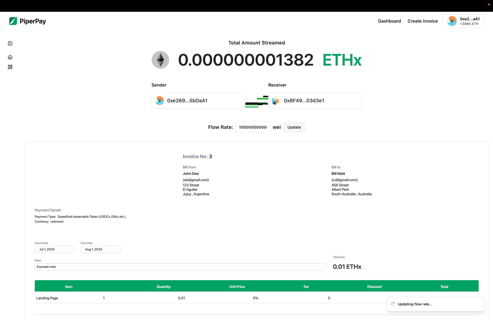
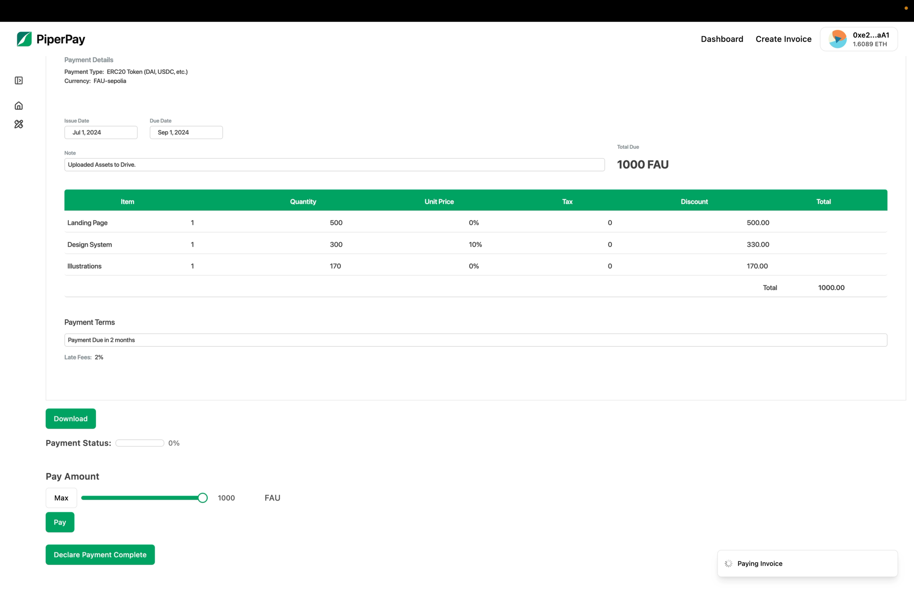
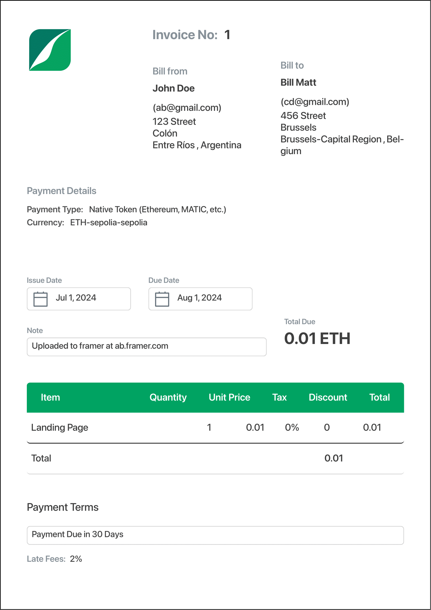

<p align="center">
</p>

PiperPay is a Invoice and Payment management system built on top of Request Network. It allows users to create invoices and accept payments in a decentralized manner.

Users can request payments in various forms such as:

- Native Cryptocurrencies: ETH, MATIC, etc.
- ERC20 Tokens: DAI, USDC, etc.
- Bitcoin
- Fiat Currencies: USD, EUR, etc.
- Superfluid Streams

## How it works 🛠️

The Invoice follows `rnf_invoice-0.0.3` schema standard by request network.

1. **Create Invoice**: Users can create an invoice by specifying Party Details, Payment Details, and Invoice Details. Entire invoice creation process is validated using `Zod` and `React Hook Form`.
2. Invoices can be downloaded as PDFs using `@react-pdf/renderer`.
3. **Payment**: Users can pay the invoice various methods such as from a smart contract proxy, swap tokens, or pay directly.

## Demo Video 🎥

[](https://www.youtube.com/watch?v=l5eMEywt_TY)

https://youtu.be/l5eMEywt_TY

## Screenshots 📸

<table>
  <tr>
    <td valign="top" width="50%">
      <br>
      
    </td>
    <td valign="top" width="50%">
      <br>
      
    </td>
  </tr>
</table>

<table>
  <tr>
    <td valign="top" width="50%">
      <br>
            
    </td>
    <td valign="top" width="50%">
      <br>
            
    </td>
  </tr>
</table>

<table>
  <tr>
    <td valign="top" width="50%">
      <br>
            
    </td>
    <td valign="top" width="50%">
      <br>
            
    </td>
  </tr>
</table>

<table>
  <tr>
    <td valign="top" width="50%">
      <br>
            
    </td>
    <td valign="top" width="50%">
      <br>
            
    </td>
  </tr>
</table>

## 🧑🏼‍💻 Tech Stack

- **Frontend**: Next.js, Tailwind CSS, shadcn
- **Integration**: `@requestnetwork/request-client.js`

## Get Started 🚀

The following repository is a turborepo and divided into the following:

- **apps/www** - The web application built using Next.js.

First install the dependencies by running the following:

```
pnpm install
```

Then fill in the Environment variables in `apps/www/.env.local`

```env
NEXT_PUBLIC_WALLETCONNECT_ID="walletconnect_project_ir"
```

Finally, run the following command to start the application:

```
pnpm dev
```
